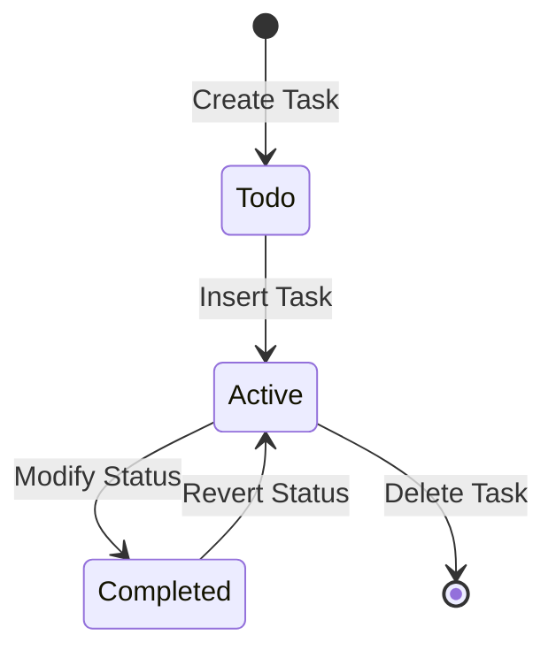

# To-Do List API 🚀

A lightweight, flexible FastAPI-based todo list management system with intuitive CRUD operations.

## 🌟 Overview

This To-Do List API provides a simple, efficient backend for managing personal tasks with features like task insertion, status modification, and filtering.

## 🏗️ Architecture Diagram



## 🛠️ Installation

1. Clone the repository:
   ```bash
   git clone https://github.com/Caio-Felice-Cunha/To-Do-List-API.git
   cd To-Do-List-API
   ```

2. Create a virtual environment:
   ```bash
   python -m venv venv
   source venv/bin/activate  # On Windows, use `venv\Scripts\activate`
   ```

3. Install dependencies:
   ```bash
   pip install fastapi uvicorn
   ```

4. Run the server:
   ```bash
   uvicorn main:app --reload
   ```

## 🚦 Endpoints

- `POST /insert`: Add a new todo item
- `POST /mylist`: Retrieve todo items (with optional filtering)
- `GET /todo/{id}`: Get a specific todo item
- `POST /modifyStatus`: Toggle task completion status
- `POST /deleteItem`: Remove a todo item

## 🤝 Contributing

1. Fork the repository
2. Create a feature branch: `git checkout -b feature/your-feature`
3. Commit changes: `git commit -m 'Add some feature'`
4. Push to the branch: `git push origin feature/your-feature`
5. Open a pull request

## 🐛 Known Issues & Future Plans

- Persistent storage not implemented
- No authentication mechanism
- Future: Add database integration
- Future: Implement user authentication

## 📄 License

MIT License - See LICENSE file for details.

## ⚖️ Credits

This project was developed as part of the "4 Days 4 Projects" initiative by [Pythonando](https://pythonando.com.br) on YouTube.

## 👥 Authors

Caio Felice Cunha