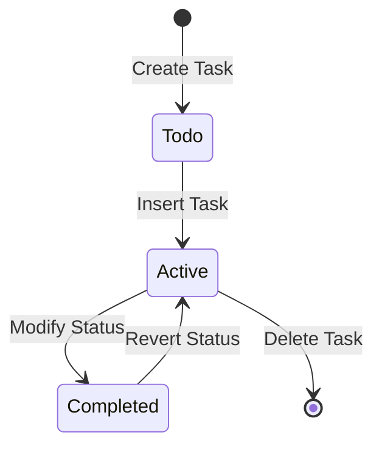

# To-Do List API 🚀

A lightweight, flexible FastAPI-based todo list management system with intuitive CRUD operations.

## 🌟 Overview

This To-Do List API provides a simple, efficient backend for managing personal tasks with features like task insertion, status modification, and filtering.

## 🏗️ Architecture Diagram


```mermaid
stateDiagram-v2
    [*] --> Todo: Create Task
    Todo --> Active: Insert Task
    Active --> Completed: Modify Status
    Active --> [*]: Delete Task
    Completed --> Active: Revert Status
```

## 🛠️ Installation

1. Clone the repository:
   ```bash
   git clone https://github.com/Caio-Felice-Cunha/To-Do-List-API.git
   cd To-Do-List-API
   ```

2. Create a virtual environment:
   ```bash
   python -m venv venv
   source venv/bin/activate  # On Windows, use `venv\Scripts\activate`
   ```

3. Install dependencies:
   ```bash
   pip install -r requirements.txt
   ```

4. Run the server:
   ```bash
   uvicorn todoapi:app --reload
   ```

   Interactive docs are then available at `http://127.0.0.1:8000/docs`.

## 🚦 Endpoints

- `POST /insert`: Add a new todo item. Body: `{"task": str, "done": bool, "deadline": "YYYY-MM-DD" or omitted}`.
- `POST /mylist`: Retrieve todo items. Query param `optional`: `0` all (default), `1` pending only, `2` done only. Any other value returns 422.
- `GET /todo/{id}`: Get a specific todo item by its list position. Out-of-range or negative ids return 404.
- `POST /modifyStatus`: Toggle a task's completion status. Query param `id`.
- `POST /deleteItem`: Remove a todo item. Query param `id`.

## ✅ Running the tests

```bash
pip install -r requirements.txt
pytest
```

The suite (`test_todoapi.py`) covers insert, list, filtering, get, status toggle, and delete, plus the 404 cases for negative and out-of-range ids.

## 🤝 Contributing

1. Fork the repository
2. Create a feature branch: `git checkout -b feature/your-feature`
3. Commit changes: `git commit -m 'Add some feature'`
4. Push to the branch: `git push origin feature/your-feature`
5. Open a pull request

## 🐛 Known Issues & Future Plans

- Persistent storage not implemented. The list lives in memory and is cleared on restart.
- No authentication mechanism.
- Ids are list positions, so they shift after a deletion. Delete id `0` and every later item's id drops by one. This is fine for a single-session demo but not for a shared or long-lived store.
- Future: add database integration (which would also give stable ids).
- Future: implement user authentication.

## 📄 License

MIT License - See LICENSE file for details.

## ⚖️ Credits

This project was developed as part of the "4 Days 4 Projects" initiative by [Pythonando](https://pythonando.com.br) on YouTube.

## 👥 Authors

Caio Felice Cunha